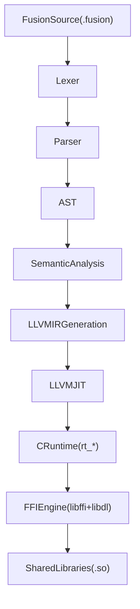

# Fusion

Linux-only programming language with LLVM backend, C runtime, and full FFI for `.so` libraries (CUDA/NCCL-capable).

This README has two main parts:

- **Language guide** – how to write and run Fusion programs.
- **Build guide** – how to build the compiler and runtime from source.

For a deeper architecture and project roadmap, see `fusion-design-document.md`.

---

## Fusion language overview

Fusion is a small, systems-style language designed to call into existing C APIs (including CUDA and NCCL) with as little ABI friction as possible. Programs are compiled to LLVM IR and JIT-executed against a C runtime that handles printing, file I/O, dynamic loading (`dlopen`/`dlsym`), and `libffi`-based FFI calls.

At a high level, a `.fusion` file looks like this:

- Optional `opaque` and `struct` type declarations.
- One or more `extern lib` and `extern fn` declarations describing C functions in `.so` libraries.
- Zero or more user `fn` definitions.
- A sequence of top-level `let` bindings, `if` / `elif` / `else` statements, `for` loops, assignments, and expressions that are executed in order.

The compiler synthesizes a `fusion_main` function that evaluates the top-level items sequentially; user-defined functions are called from that top-level code or from other functions.

---

## Quick start: first Fusion program

Create `example.fusion`:

```fusion
struct Point { x: f64; y: f64; };

extern lib "libm.so.6" {
  fn cos(x: f64) -> f64;
};

fn shift(v: f64) -> f64 {
  let x = v + 1;
  return x;
}

let z = cos(1.0);
print(z);

let p = alloc(Point);
store_field(p, Point, x, 3.0);
store_field(p, Point, y, 4.0);
print(load_field(p, Point, x));
print(load_field(p, Point, y));

let x = z + 2;
if (x > 0) {
  print(1);
} else {
  print(0);
}

print(shift(x));
```

Build Fusion (see the build section below), then run:

```bash
./build/compiler/fusion run example.fusion
```

or equivalently:

```bash
./build/compiler/fusion example.fusion
```

`fusion` will:

- Lex and parse the source,
- Run semantic checks (types, arity, FFI declarations, etc.),
- Generate LLVM IR and JIT it,
- Execute the synthesized `fusion_main` that runs your top-level code.

---

## Core language concepts

### Program structure

Top-level items are processed in the following order:

1. `opaque` type declarations, e.g.:
   ```fusion
   opaque cudaStream_t;
   ```
2. `struct` definitions, e.g.:
   ```fusion
   struct Point { x: f64; y: f64; };
   ```
3. `extern lib` and `extern fn` declarations:
   ```fusion
   extern lib "libm.so.6";
   extern fn cos(x: f64) -> f64;
   ```
   or a block form:
   ```fusion
   extern lib "x.so" {
     fn foo() -> void;
     fn bar() -> i64;
   };
   ```
4. User-defined functions:
   ```fusion
   fn f(x: i64) -> i64 {
     if (x > 0) { return 1; }
     return 0;
   }
   ```
5. A sequence of top-level items executed in order:
   - `let` bindings, e.g. `let x = 1 + 2;`
   - `if` / `elif` / `else` statements
   - `for` loops
   - Assignments, e.g. `a[0] = 42;`
   - Standalone expressions (commonly `print(...)` calls)

The last expression is *not* special; there is no REPL-style implicit print. All output is explicit via `print`.

### Lexical basics and syntax

- **Comments** start with `#` and run to the end of the line:
  ```fusion
  # This is a comment
  ```
- **Literals**:
  - Integer literals: `0`, `1`, `42`
  - Float literals: `0.0`, `3.14`, `1e-3`
  - String literals: `"hello"`, `"path/to/file.txt"`
- **Punctuation**:
  - Parentheses `()`, braces `{}`, brackets `[]`
  - Comma `,`, semicolon `;`, colon `:`
- **Operators**:
  - Arithmetic: `+`, `-`, `*`, `/`
  - Comparison: `==`, `!=`, `<`, `<=`, `>`, `>=`
- **Statement termination**:
  - Inside blocks and at top level, most statements end with `;`.
  - `if` and `for` introduce blocks with `{ ... }` instead of `;` at the end of the header line.

---

## Types

Fusion’s core value-level types correspond directly to FFI-level types:

- `i32`, `i64` – signed integers
- `f32`, `f64` – floating-point numbers
- `ptr` – raw pointer (opaque at the language level)
- `ptr` – pointer type (including pointers to C-style strings; use `ptr` wherever you would pass `const char*` or `void*` in C)
- `void` – used as a function return type

String literals have pointer type and can be passed where a `ptr` is expected.

There is currently **no dedicated `bool` type**. Conditions are numeric:

- Comparison operators yield an `i64` “boolean” (0 or 1) used in `if` and `for` conditions.

### Opaque and struct types

Opaque types are names for ABI-level pointers that Fusion never inspects:

```fusion
opaque cudaStream_t;
```

Struct types are C-layout records:

```fusion
struct Point {
  x: f64;
  y: f64;
};
```

Struct field types must be primitive FFI types (e.g. `i64`, `f64`, `ptr`). Layout (size, alignment, offsets) is computed according to the SysV AMD64 ABI and is validated in tests.

When structs or opaque types flow across the FFI boundary, they are represented as pointers:

- In `extern fn` declarations, parameters and returns that use a named type (opaque or struct) are lowered to pointer types at the ABI level.

### Expression typing and numeric promotion

- Integer literals default to `i64`.
- Float literals default to `f64`.
- Binary arithmetic (`+`, `-`, `*`, `/`):
  - If either operand is `f64`, the result is `f64`.
  - Otherwise, the result is `i64`.

This means that:

- `1 + 2` is `i64`
- `cos(1.0) + 2` is `f64` and stays `f64` (tests assert that result is not truncated).

---

## Expressions

Common expression forms include:

- **Arithmetic**: `1 + 2 * 3`, `x - 4`, `y / 2.0`
- **Comparison**: `x > 0`, `a == b`, `p != q`
- **Variable references**: `x`, `point`
- **Function calls**: `print(1)`, `cos(0.0)`, `f(x, y)`
- **Array indexing**: `a[0]`, `points[i]`
- **Pointer operations and loads** (covered later)

### Casting with `as`

Fusion supports explicit casts using `as`:

```fusion
let x = 1 as f64;
let y = 3.14 as i64;
let p = some_ptr as ptr;
let s = some_ptr as ptr;
```

Allowed casts:

- To numeric: `as i64`, `as i32`, `as f64`, `as f32` – source must be one of those numeric types.
- To pointer-like: `as ptr` – source must already be a pointer.

Invalid casts (e.g. casting a non-pointer to `ptr`, or a pointer to a numeric type) are rejected by semantic analysis.

---

## Statements and control flow

### Let bindings and scope

`let` introduces a new immutable binding:

```fusion
let a = 1;
let b = 2;
let sum = a + b;
```

- At top level, `let` bindings live in a single global scope (no shadowing).
- Inside functions and blocks (`if` / `else` / `for` bodies), bindings live in nested scopes tracked by the compiler. Duplicate names in the same scope are rejected.

### If / elif / else

Syntax:

```fusion
if (x > 0) {
  print(1);
} elif (x < 0) {
  print(-1);
} else {
  print(0);
}
```

- `elif` is syntactic sugar for a nested `if` in the `else` branch.
- Conditions must be comparison expressions over numeric types or pointer equality/inequality (`==` / `!=`).
- Pointer comparisons are restricted to `==` and `!=`.

### For-in loops

Fusion supports iteration over:

- Ranges produced by `range(...)`.
- Arrays allocated with `alloc_array(...)`.

Examples:

```fusion
for i in range(5) {
  print(i);
}

let arr = alloc_array(i64, 3);
arr[0] = 1;
arr[1] = 2;
arr[2] = 3;

for x in arr {
  print(x);
}
print(0);
```

The loop variable’s type is inferred from the iterable:

- For `range(n)`, elements default to `i64`.
- For `range(n, f64)`, elements are `f64`, etc.
- For arrays from `alloc_array(T, n)`, elements are of type `T`.

Attempting to iterate over a non-array, non-range value is a semantic error.

### Assignments

Assignments are standalone statements:

```fusion
let x = 1;
x = x + 1;

let a = alloc_array(i64, 3);
a[0] = 42;
```

Targets:

- A variable: `x = expr;`
- An indexed array element: `a[i] = expr;`

Assignments must be type-compatible. Some limited pointer/int compatibility is allowed where it matches ABI usage (e.g. `ptr` vs `i64` in certain contexts), otherwise the compiler reports an error.

### Functions

Function definition syntax:

```fusion
fn sign(x: i64) -> i64 {
  if (x > 0) { return 1; }
  elif (x < 0) { return -1; }
  else { return 0; }
}

print(sign(5));
```

- Parameters are typed: `name: type`.
- Return type appears after `->`.
- Return types and parameter types must be FFI types (`i32/i64/f32/f64/ptr/void`) or named struct/opaque types (lowered to pointers).
- `return` is only valid inside functions and must match the declared return type.

---

## Memory, pointers, arrays, and structs

### Allocation intrinsics

These are built-in functions parsed specially by the compiler:

```fusion
let p = alloc(Point);
let buf = alloc_bytes(1024);
let xs = alloc_array(i64, 10);
```

- `alloc(T)`:
  - `T` can be a primitive (`i32`, `i64`, `f32`, `f64`), `ptr`, or a user-defined struct/opaque name.
  - Returns a `ptr` pointing to storage for one `T`.
- `alloc_array(T, count)`:
  - `T` as above, `count` must be `i64`.
  - Returns a `ptr` to an array of `count` elements.
- `alloc_bytes(size)`:
  - `size` must be `i64`.
  - Returns a raw `ptr` to `size` bytes.

All three intrinsics lower to runtime allocations implemented in the C runtime and LLVM IR.

### Pointer operations and indexing

Core pointer operations:

```fusion
let p = alloc(i64);
store(p, 42);
let v = load(p);

let q = addr_of(v);      # address of a variable
let f = load_f64(fp);    # load as f64
let ip = load_ptr(pp);   # load pointer
```

- `addr_of(var)` – pointer to a variable binding.
- `load(p)` – load `i64` from a pointer.
- `load_f64(p)` – load `f64` from a pointer.
- `load_i32(p)` – load `i32` from a pointer.
- `load_ptr(p)` – load `ptr` from a pointer.
- `store(p, value)` – store a value through a pointer.

Array indexing:

```fusion
let a = alloc_array(i64, 3);
a[0] = 10;
a[1] = 20;
a[2] = 30;
print(a[0]);
```

- Base expression must be a pointer produced by `alloc_array` or `range` (or a `let` binding of such).
- Index expression must be `i64`.
- The element type is inferred from the array or from the `range` type parameter.

### Structs and field access

Struct declarations:

```fusion
struct Point { x: f64; y: f64; };
```

Usage:

```fusion
let p = alloc(Point);
store_field(p, Point, x, 3.0);
store_field(p, Point, y, 4.0);
print(load_field(p, Point, x));
print(load_field(p, Point, y));
```

- `store_field(p, StructName, field, value)`:
  - `p` must be a pointer.
  - `StructName` and `field` must refer to a known struct and field.
  - Value type must be compatible with the field type.
- `load_field(p, StructName, field)`:
  - Returns the field value with the appropriate type (`i64`, `f64`, `ptr`, etc.).

Layout is computed from the struct definition according to the platform ABI and is shared with the FFI system.

---

## Built-in library and I/O helpers

### Printing and streams

`print` is a built-in with two forms:

```fusion
print(42);          # default stream
print(3.14);
print("hello");
print(42, 1);       # optional stream id (i64)
```

Supported value types:

- `i64` (and other integers widened to `i64`)
- `f64` (and other floats widened to `f64`)
- `ptr` (including string literals and pointers to C strings)

The second argument, when present, must be `i64` and is interpreted as a stream identifier by the runtime (e.g., stdout/stderr).

### Ranges and iteration

`range` constructs array-like sequences backed by the runtime:

```fusion
for i in range(5) {
  print(i);
}

for x in range(3, f64) {
  print(x);
}

for i in range(2, 6) {
  print(i);
}
```

Supported forms:

- `range(end)` – yields `0 .. end-1` as `i64`.
- `range(0, end, T)` – yields a typed range `T` (`i32`, `i64`, `f32`, `f64`).
- `range(start, end)` – yields `start .. end-1` as `i64`.

The exact overloads are implemented via the parser’s handling of optional numeric type arguments and are type-checked by semantic analysis.

### Strings and numeric conversion

The runtime exposes helpers for converting between strings and numbers:

```fusion
let line = read_line();
let n = from_str(line, i64);
let s = to_str(n);
print(s);
```

- `read_line()`:
  - Reads a single line from stdin.
  - Returns a `ptr` (null-terminated string managed by the runtime).
- `to_str(x)`:
  - `x` must be `i64` or `f64`.
  - Returns a `ptr` to a string representation of the number.
- `from_str(s, T)`:
  - `s` must be a pointer (`ptr`) to a string.
  - `T` is `i64` or `f64`.
  - Returns a numeric value, `0` / `0.0` on invalid input.

### File I/O

The C runtime provides simple file APIs surfaced through built-ins:

```fusion
let path = "data.txt";
let mode = "r";
let f = open(path, mode);

while (eof_file(f) == 0) {
  let line = read_line_file(f);
  print(line);
}

close(f);
```

Available operations:

- `open(path, mode)`:
  - Both arguments must be pointer/string values.
  - Returns a file handle pointer (opaque).
- `close(handle)` – closes the file handle.
- `read_line_file(handle)` – returns next line as a pointer/string.
- `write_file(handle, value)`:
  - `value` can be `i64`, `f64`, or pointer/string.
- `eof_file(handle)` – returns `i64` (0 = not EOF, non-zero = EOF).
- `line_count_file(handle)` – returns `i64` count of lines read so far.

These functions are type-checked by the compiler to ensure handles are pointers and value types are compatible.

---

## FFI declarations and interop

### Declaring libraries

You can declare external libraries in two ways.

**Simple form:**

```fusion
extern lib "libm.so.6";
extern fn cos(x: f64) -> f64;
```

The compiler assigns an internal name like `__lib0` and binds `cos` to that library.

**Block form with explicit functions:**

```fusion
extern lib "mylib.so" {
  fn foo() -> void;
  fn bar(x: i64) -> i64;
};
```

All functions inside the block are associated with the same library.

You can also alias the library name:

```fusion
extern lib "libm.so.6" as libm;
extern fn cos(x: f64) -> f64;
```

### Declaring external functions

Syntax:

```fusion
extern lib "libm.so.6";
extern fn cos(x: f64) -> f64;
```

or inside a block, as shown above.

Parameter and return types:

- Keyword types (`i32`, `i64`, `u32`, `u64`, `f32`, `f64`, `ptr`, `void`) map directly to FFI primitive kinds.
- Named types (structs and opaques) are treated as pointers at the ABI layer.

The compiler verifies:

- That every `extern fn` refers to a declared library.
- That names used as struct/opaque types are known.

### Type mapping to C

Fusion’s FFI mapping is defined by the runtime (`rt_ffi_type_kind_t`) and the semantic layer. In practice:

| Fusion type | C / ABI type                |
|------------|-----------------------------|
| `i32`      | `int32_t`                   |
| `i64`      | `int64_t` / `long long`     |
| `f32`      | `float`                     |
| `f64`      | `double`                    |
| `ptr`      | `void*`                     |
| (strings)  | use `ptr`; C side is `const char*` or `void*` as appropriate |
| struct/opaque name | pointer to that type (`T*`) |

The platform assumptions for v1 are:

- Linux x86-64
- SysV AMD64 ABI
- ELF shared libraries (`.so`)

### Calling externs from Fusion

Putting it all together:

```fusion
extern lib "libm.so.6";
extern fn cos(x: f64) -> f64;

let v = cos(0.0);
print(v);
```

At runtime, the generated code:

- Uses the C runtime to `dlopen("libm.so.6")`.
- Uses `dlsym` to find the `cos` symbol.
- Uses `libffi` to prepare and invoke a call with one `double` argument and `double` return.
- Unmarshals the result back into a Fusion `f64`.

More advanced examples (structs by pointer, out-parameters) are covered in tests and example `.fusion` programs such as `example.fusion`, `example_points.fusion`, and `train_moons.fusion`.

---

## Execution model and CLI

The `fusion` CLI is built in `build/compiler/fusion`. It supports:

- `fusion --help` / `fusion -h` – show help and usage.
- `fusion --version` / `fusion -v` – show compiler and LLVM version.
- `fusion run file.fusion` – compile and JIT-run a `.fusion` file.
- `fusion file.fusion` – shorthand for `fusion run file.fusion`.

On each run, the compiler:

1. Lexes the input.
2. Parses into an AST.
3. Runs semantic checks (types, FFI declarations, built-in usage, etc.).
4. Lowers to LLVM IR, verifies the module, and JITs it.
5. Executes `fusion_main`.

Errors are reported with a message and (where possible) line/column information from the parser or semantic analyzer.

### Common errors and diagnostics

Some common classes of semantic errors:

- **Undefined variable**:
  ```fusion
  let x = 1;
  print(y);   # y is undefined
  ```
- **Wrong arity**:
  ```fusion
  print(1, 2, 3);  # print only accepts 1 or 2 arguments
  ```
- **Invalid FFI declaration**:
  - Extern function refers to an unknown library.
  - Extern function uses an unknown struct/opaque type name.
- **Invalid `for` iterable**:
  ```fusion
  let n = 5;
  for i in n {      # n is not an array or range
    print(i);
  }
  ```
- **Invalid casts** or mis-typed pointer operations:
  - `load`/`load_f64`/`load_ptr` require pointer arguments.
  - `store` requires a pointer as the first argument.
  - `cast` target type must be one of the supported numeric or pointer-like types.

The error messages are designed to be explicit about which built-in or function caused the problem.

---

## Architecture (high level)

Conceptually, Fusion’s execution stack looks like this:



- The **compiler frontend** (lexer, parser, semantic analysis) is implemented in C++.
- The **backend** uses LLVM to build and JIT modules.
- The **C runtime** (`runtime_c`) provides printing, file I/O, dynamic loading, and FFI services.
- The **FFI engine** uses `libffi` and `libdl` to dynamically call into arbitrary `.so` libraries.

For much more detail on this architecture and the long-term roadmap (including CUDA/NCCL integration and potential bindgen tooling), read `fusion-design-document.md`.

---

## Build and test (Linux)

Same as CI:

```bash
./ci/build_and_test.sh
```

Or use the wrapper Makefile (out-of-tree build):

```bash
make
make check
```

Or manually:

```bash
cmake -B build -S .
cmake --build build
ctest --test-dir build --output-on-failure
```

### Exit criteria (Phase 0)

- **`fusion --help`** — Run `./build/compiler/fusion --help` for usage.
- **Runtime** — `build/runtime_c/libruntime.so` and `build/runtime_c/libruntime.a` are produced.
- **Tests** — `ctest --test-dir build` runs the C test runner and the `fusion --help` test.

---

## User-local dependencies (~/.local)

On systems where libffi or zlib are not available as dev packages (e.g. no sudo), you can install them under `~/.local` and point the build there.

**1. Install libffi**

```bash
mkdir -p "$HOME/src" "$HOME/.local"
cd "$HOME/src"
curl -LO https://github.com/libffi/libffi/releases/download/v3.4.6/libffi-3.4.6.tar.gz
tar -xzf libffi-3.4.6.tar.gz
cd libffi-3.4.6
./configure --prefix="$HOME/.local"
make -j
make install
```

**2. Install zlib** (if you see link errors for `compress2`, `uncompress`, `crc32`)

```bash
cd "$HOME/src"
curl -LO https://zlib.net/zlib-1.3.1.tar.gz
tar -xzf zlib-1.3.1.tar.gz
cd zlib-1.3.1
./configure --prefix="$HOME/.local"
make -j
make install
```

**3. Use them when building**

Source the env script so CMake and the compiler find headers and libs in `~/.local`:

```bash
source ./env_local_deps.sh
./test.sh
```

Or for a manual build: `source ./env_local_deps.sh` then run `cmake -B build`, `cmake --build build`, etc.

**Sanity check** (after sourcing): `pkg-config --modversion libffi` and `pkg-config --modversion zlib` should print versions.

**Option A via CMake:** If you prefer not to install libffi manually, you can have CMake download and build it into the build tree:

```bash
cmake -B build -S . -DFUSION_FETCH_LIBFFI=ON
cmake --build build
```

This uses ExternalProject to fetch libffi 3.4.6 and install it under `build/_deps/libffi-install` (no `~/.local` or `env_local_deps.sh` needed).

---

## LLVM (required)

LLVM is required to build Fusion. If LLVM is not installed, CMake will try to find it; on Linux, if not found, CMake can download a pre-built LLVM into `build/_deps/llvm` on first configure (set `FUSION_DOWNLOAD_LLVM=ON`, which is the default on Linux).

**Auto-download (no sudo):** On Linux, if LLVM is not found, CMake downloads a pre-built LLVM (x86_64 Linux) into `build/_deps/llvm`. To disable auto-download and supply LLVM yourself:

```bash
cmake -B build -S . -DFUSION_DOWNLOAD_LLVM=OFF
```

To use a different LLVM version when auto-downloading:

```bash
cmake -B build -S . -DFUSION_LLVM_VERSION=18.1.7
```

If LLVM cannot be found or downloaded, configure will fail with an error.
